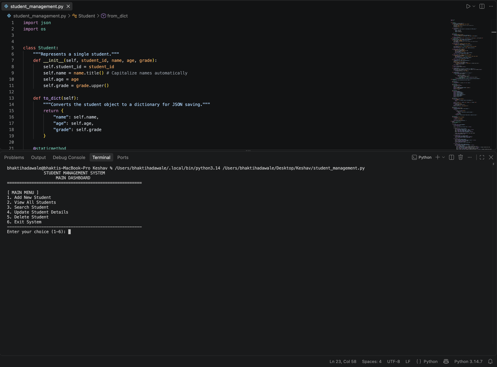

# 🎓 Student Management System

## 📖 Overview
The **Student Management System** is a command-line interface (CLI) application built with Python. It provides a robust and user-friendly way to manage student records, including adding, viewing, searching, updating, and deleting student information. The application utilizes Object-Oriented Programming (OOP) principles and ensures data persistence by saving records to a local JSON file.

## Application screenshot



## ✨ Features
- **Add Students**: Register new students with a unique ID, name, age, and grade/major.
- **View Records**: Display a formatted, tabular list of all registered students.
- **Search Functionality**: Quickly find students by their ID or Name (case-insensitive partial matching).
- **Update Details**: Modify existing student information without losing their ID.
- **Delete Records**: Remove students from the database.
- **Data Persistence**: Automatically saves and loads data to/from `students_data.json`.
- **Input Validation**: Prevents invalid data entry (e.g., ensures age is a positive integer).
- **Clean UI**: Features a formatted console dashboard with cross-platform screen clearing and visual feedback (✅/❌/⚠️).

## 🏗️ Architecture & Design
The project is designed using a **Separation of Concerns** approach, dividing the logic into three distinct classes:

1. **`Student` (Model)**: 
   - Represents the core data entity.
   - Handles data formatting (e.g., auto-capitalizing names and grades).
   - Contains serialization methods (`to_dict`, `from_dict`) for JSON conversion.
2. **`StudentManager` (Controller/Service)**: 
   - Handles all business logic and CRUD (Create, Read, Update, Delete) operations.
   - Manages file I/O operations (`save_data`, `load_data`).
   - Stores student objects in a dictionary for fast O(1) lookups by ID.
3. **`ConsoleUI` (View)**: 
   - Handles all terminal outputs, menus, and user inputs.
   - Contains input validation logic (e.g., `get_valid_integer`).
   - Formats data into clean, readable ASCII tables.

## 💾 Data Storage
The system uses a local JSON file (`students_data.json`) as a lightweight database. 
- **Auto-Save**: Data is written to the file immediately after any Add, Update, or Delete operation.
- **Auto-Load**: Upon startup, the system checks for the JSON file and loads existing records into memory.
- **Error Handling**: If the JSON file is corrupted, the system catches the `JSONDecodeError`, warns the user, and starts with a clean database.

## 🚀 Installation & Usage

### Prerequisites
- Python 3.6 or higher (No external libraries required; uses built-in `json` and `os` modules).

### How to Run
1. Ensure you have Python installed on your system.
2. Open your terminal or command prompt.
3. Navigate to the directory containing `student_management.py`.
4. Run the script:
   ```bash
   python student_management.py